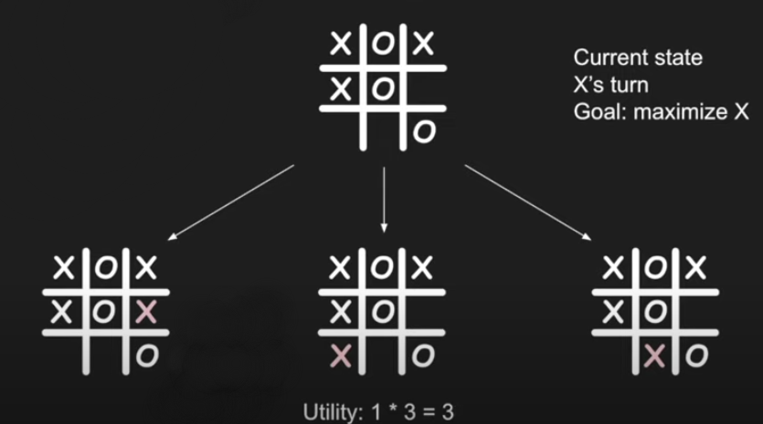
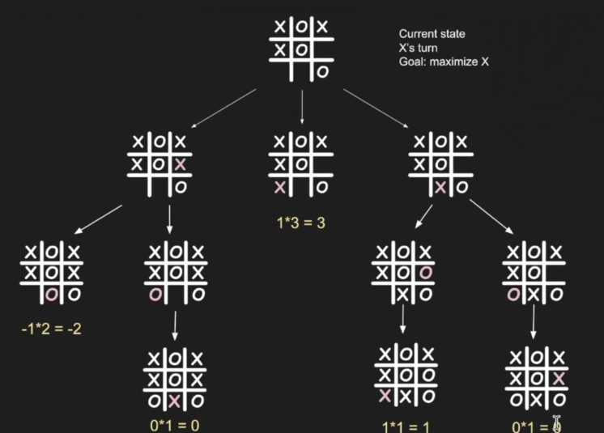
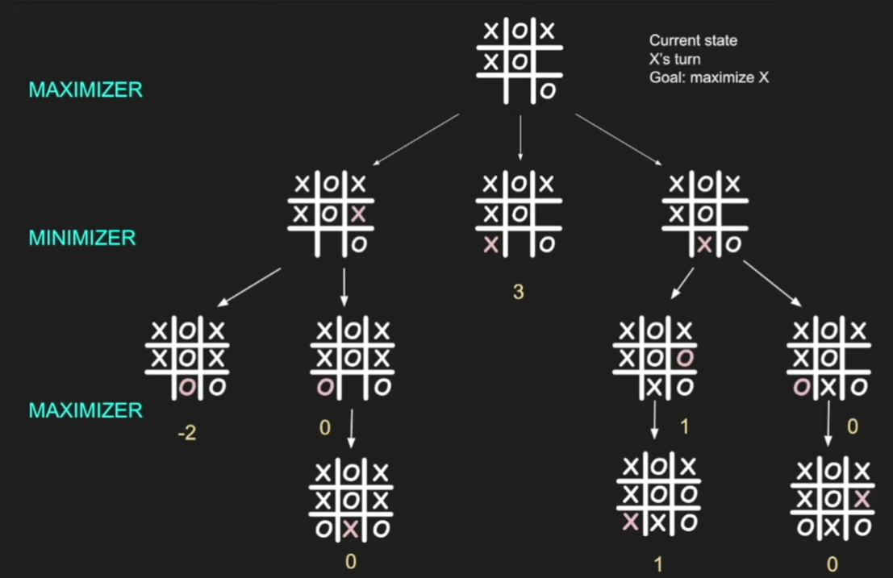

# 12 Beginner Python Projects - Coding Course

## Additional info

yt link: <https://www.youtube.com/watch?v=8ext9G7xspg>

## Table of Contents

1. Madlibs
2. Guess the Number (computer)
3. Guess the Number (user)
4. Rock Paper Scissors
5. Hangman
6. Tic-Tac-Toe
7. Tic-Tac-Toe AI
8. Binary Search
9. Minesweeper
10. Sudoku Solver
11. Photo Manipulation in Python
12. Markov Chain Text Composer

## 1. Madlibs

Link to madlibs.py

## 2. Guess the Number (user)

Computer creates the nr, person guesses

Link to guess_user.py

## 3. Guess the Number (computer)

User creates the nr, computer guesses

Link to guess_computer.py

## 4. Rock Paper Scissors

Link to rock_paper_scissors.py

## 5. Hangman

Link to hangman.py

## 6. Tic-Tac-Toe

Link to ttt_game.py

Link to ttt_player.py

## 7. Tic-Tac-Toe AI

Create an algorithm, where computer never loses using Minimax.

- you maximize your win
- opponent minimizes their loss

Where algorithm tries to find the best move to take, by trying out every move to find which one is the most optimal, through utility function, which is a measurement of how valuable the final result of that tree is.

Utility function:

- ix x wins: then 1
- if o wins: then -1
- multiplied by: remaining squares + 1

Maximize X chance of win,
minimize O chances of win

## 8. Binary Search

Link to binary.py

## 9. Minesweeper

## 10. Sudoku Solver

## 11. Photo Manipulation in Python

## 12. Markov Chain Text Composer
